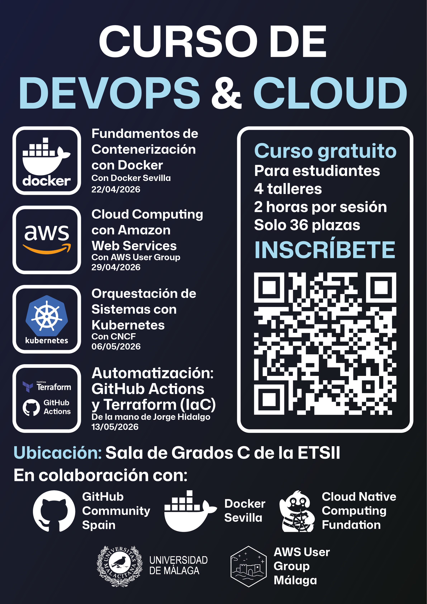

# Sesión 1: Contenerización con Docker

## De 0 a entorno local reproducible

<p class="subtitle"><strong>Objetivo:</strong> estandarizar el desarrollo y despliegue de aplicaciones</p>



---

# Aislamiento vs. Virtualización Tradicional

<div class="cols">
  <div class="card bad">
    <h2>Virtualización (VM)</h2>
    <ul>
      <li>SO completo por instancia</li>
      <li>Arranque más lento</li>
      <li>Mayor consumo de RAM/CPU</li>
    </ul>
  </div>
  <div class="card good">
    <h2>Contenedores (Docker)</h2>
    <ul>
      <li>Kernel compartido</li>
      <li>Inicio en segundos</li>
      <li>Portables y ligeros</li>
    </ul>
  </div>
</div>

<p class="footer-note"><span class="accent">Idea clave:</span> Docker empaqueta aplicación + dependencias, no un sistema operativo completo.</p>

---

# Caso Real: COMPÁS VIRTUAL se cae

<div class="cols">
  <div class="card bad">
    <h2>⚠️ Crisis sin Docker</h2>
    <ul class="tiny">
      <li>Página caída 🔴</li>
      <li>SSH a servidor</li>
      <li>Revisar logs, configs</li>
      <li>¿Qué versión de Node?</li>
      <li>¿Qué commit del código?</li>
      <li>30 min sin servicio 📉</li>
    </ul>
  </div>
  <div class="card good">
    <h2>✅ Respuesta con Docker</h2>
    <ul class="tiny">
      <li>Página caída 🔴</li>
      <li><code>docker run compas-virtual</code></li>
      <li>✅ Instancia 2 levantada</li>
      <li>Servicio restaurado (5s)</li>
      <li>O replicar en 3 servidores</li>
      <li>Load balancer distribuye</li>
    </ul>
  </div>
</div>

<p class="footer-note"><strong>La imagen es tu backup vivo:</strong> instancia múltiples contenedores cuando sea necesario.</p>

---

# Imagen vs. Contenedor

<div class="cols">
  <div class="card">
    <h2>🖼️ Imagen</h2>
    <ul class="tiny">
      <li><strong>Plantilla</strong> estática inmutable</li>
      <li>Capas comprimidas en un archivo</li>
      <li>Se construye una vez</li>
      <li><code>docker build</code></li>
      <li>Se descarga de Registry</li>
    </ul>
  </div>
  <div class="card">
    <h2>📦 Contenedor</h2>
    <ul class="tiny">
      <li><strong>Instancia</strong> ejecutable viva</li>
      <li>Copia de lectura-escritura de la imagen</li>
      <li>Múltiples contenedores de la misma imagen</li>
      <li><code>docker run</code></li>
      <li>Procesos en ejecución</li>
    </ul>
  </div>
</div>

<div class="flow">
<strong>Analógía:</strong> Imagen = <span class="accent">Clase</span> / Contenedor = <span class="accent">Instancia</span> de esa clase
</div>

<p class="footer-note">Una imagen puede generar <strong>N contenedores simultáneos</strong>, cada uno con su estado aislado.</p>

---

# Arquitectura de Docker

<div class="flow">
  <strong>CLI</strong> (<code>docker ...</code>)
  <span class="accent"> -> </span>
  <strong>Docker Engine API</strong>
  <span class="accent"> -> </span>
  <strong>Docker Daemon</strong>
  <span class="accent"> -> </span>
  <strong>Containers / Images / Volumes / Networks</strong>
</div>

<div class="flow">
  <strong>Daemon</strong>
  <span class="accent"> <-> </span>
  <strong>Registry</strong> (<code>Docker Hub</code>) para <code>pull</code> y <code>push</code>
</div>

<p class="footer-note">Piensa en Docker como una <strong>fabrica + gestor</strong> de entornos aislados.</p>

---

# Dominio de la CLI y Docker Desktop

<div class="cols">
  <div class="card">
    <h2>CLI minima que debes dominar</h2>
    <ul class="tiny">
      <li><code>docker run</code> crea y arranca</li>
      <li><code>docker ps</code> inspecciona estado</li>
      <li><code>docker exec</code> entra al contenedor</li>
      <li><code>docker logs</code> depura rapido</li>
    </ul>
  </div>
  <div>

```bash
docker run -d --name web -p 8080:80 nginx:alpine
docker ps
docker logs web
docker exec -it web sh
```

  </div>
</div>

<p class="footer-note">Docker Desktop te da visibilidad visual; la CLI te da <strong>velocidad y control</strong>.</p>

---

# Dockerfile desde cero

<p class="tiny">Un Dockerfile es una receta reproducible. Cada instrucción crea una capa.</p>

```dockerfile
FROM node:20-alpine
WORKDIR /app
COPY package*.json ./
RUN npm ci --only=production
COPY . .
CMD ["node", "server.js"]
```

<p class="footer-note"><strong>Regla:</strong> primero dependencias, luego codigo. Asi aprovechas cache y compila mas rapido.</p>

---

# Buenas Prácticas en Dockerfiles

<div class="cols">
  <div class="card bad">
    <h2>Evitar</h2>
    <ul class="tiny">
      <li><code>FROM node:latest</code></li>
      <li>Copiar todo sin <code>.dockerignore</code></li>
      <li>Ejecutar como root por defecto</li>
    </ul>
  </div>
  <div class="card good">
    <h2>Aplicar</h2>
    <ul class="tiny">
      <li><code>FROM node:20-alpine</code></li>
      <li>Multi-stage build</li>
      <li>Usuario no root + imagen minima</li>
    </ul>
  </div>
</div>

```dockerfile
# stage final segura
RUN addgroup -S app && adduser -S app -G app
USER app
```

---

# Docker Compose: Orquestacion local

<div class="flow">
  <strong>web</strong>
  <span class="accent"> <-> </span>
  <strong>db</strong>
  <span class="accent"> <-> </span>
  <strong>redis</strong>
  <span class="accent"> (misma red interna)</span>
</div>

```yaml
services:
  web: { build: ., ports: ["3000:3000"], depends_on: [db] }
  db: { image: postgres:16, environment: [POSTGRES_PASSWORD=dev] }
  redis: { image: redis:7-alpine }
```

<p class="footer-note">Con <code>docker compose up -d</code> levantas todo el entorno en un solo comando.</p>

---

# Workshop practico: Dockerizacion real

<div class="cols">
  <div class="card">
    <h2>Ruta de trabajo</h2>
    <ul class="tiny">
      <li>1. Build de imagen</li>
      <li>2. Compose con app + DB</li>
      <li>3. Volumen para persistencia</li>
      <li>4. Smoke test de conectividad</li>
    </ul>
  </div>
  <div>

```bash
git clone <repo>
docker compose build
docker compose up -d
docker compose ps
curl http://localhost:3000/health
```

  </div>
</div>

<p class="footer-note"><strong>Resultado esperado:</strong> entorno reproducible, persistente y listo para desarrollo.</p>

---

# Cierre de la sesión

## Lo que ya puedes hacer hoy

- Empaquetar una app en imagen Docker.
- Levantar un stack local con Compose.
- Aplicar buenas practicas desde el primer dia.


